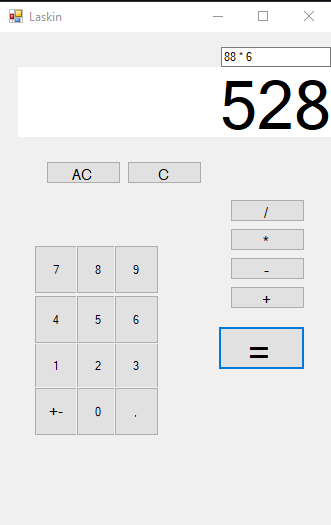

# BasicCalculator
A calculator that resembles the default one present on Windows operating systems.

## Features:
- An intuitive design with the ability to use the GUI by keyboard controls as well as only by mouse.
- After the calculation user can choose to continue by choosing one of the supported operations again (/, *, - and +)
- Ability to completely clear by using AC command or one by one using the C command (backspace in keyboard)

